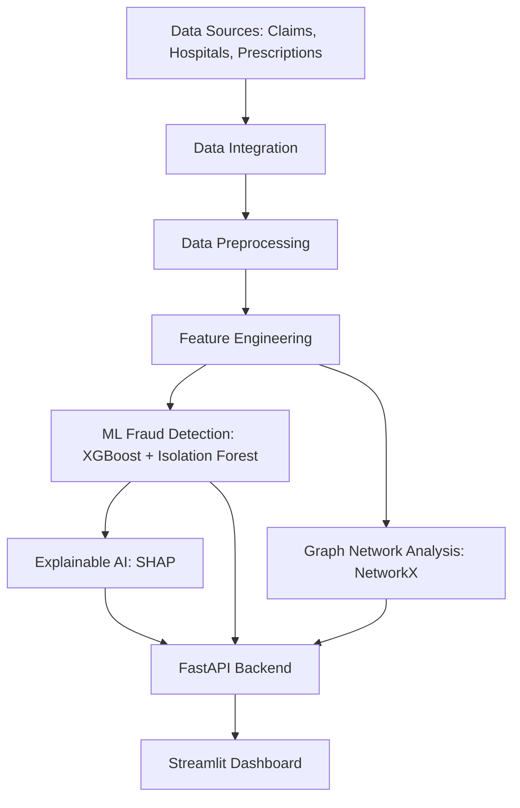

# Hybrid Healthcare Fraud Intelligence Platform

This folder contains the complete Python backend and Streamlit dashboard for the hackathon project.

## System Architecture



## Folder Structure

```
python-prototype/
├── data_simulator.py      # Generates synthetic healthcare datasets
├── preprocessing.py       # Cleans and merges datasets, feature engineering
├── model_training.py      # Trains XGBoost and Isolation Forest models
├── network_analysis.py    # Builds and analyzes patient-doctor-hospital graphs
├── explainability.py      # Generates SHAP values for model predictions
├── api.py                 # FastAPI backend serving predictions and graphs
├── app.py                 # Streamlit interactive dashboard
├── requirements.txt       # Python dependencies
└── README.md              # Instructions
```

## Instructions for Running Locally

1. **Create a virtual environment:**
   ```bash
   python -m venv venv
   source venv/bin/activate  # On Windows: venv\Scripts\activate
   ```

2. **Install dependencies:**
   ```bash
   pip install -r requirements.txt
   ```

3. **Generate Data and Train Models:**
   ```bash
   python data_simulator.py
   python preprocessing.py
   python model_training.py
   ```

4. **Run the FastAPI Backend (Terminal 1):**
   ```bash
   uvicorn api:app --reload --port 8000
   ```

5. **Run the Streamlit Dashboard (Terminal 2):**
   ```bash
   streamlit run app.py
   ```

## Deployment Steps (Streamlit Cloud / Render)

### Streamlit Cloud (Frontend)
1. Push this repository to GitHub.
2. Go to [share.streamlit.io](https://share.streamlit.io/).
3. Click "New app", select your repository, branch, and set the main file path to `python-prototype/app.py`.
4. Click "Deploy".

### Render (FastAPI Backend)
1. Go to [Render.com](https://render.com/) and create a new "Web Service".
2. Connect your GitHub repository.
3. Set the Build Command to: `pip install -r python-prototype/requirements.txt`
4. Set the Start Command to: `cd python-prototype && uvicorn api:app --host 0.0.0.0 --port $PORT`
5. Click "Create Web Service".
6. Update the `API_URL` in `app.py` to point to your new Render URL.
